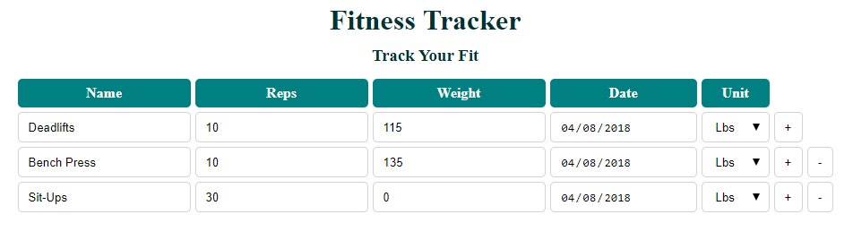

# Fitness Tracker

## Overview

A Web Development assignment that uploads fitness data activity to a database

## Link to Assignment

[Fitness Tracker](http://159.89.136.195:8884/fitness)

## Framework
  - Node.js
    - body-parser
    - express
    - express-handlebars
    - mysql

## Improvements
- Individual fitness record per user with authentication (e.g. sessions and OAuth)
- Add calendar layout option
- Incorporate number of sets
- Add flexibility for other Fitness Activities
- Use code comments!
